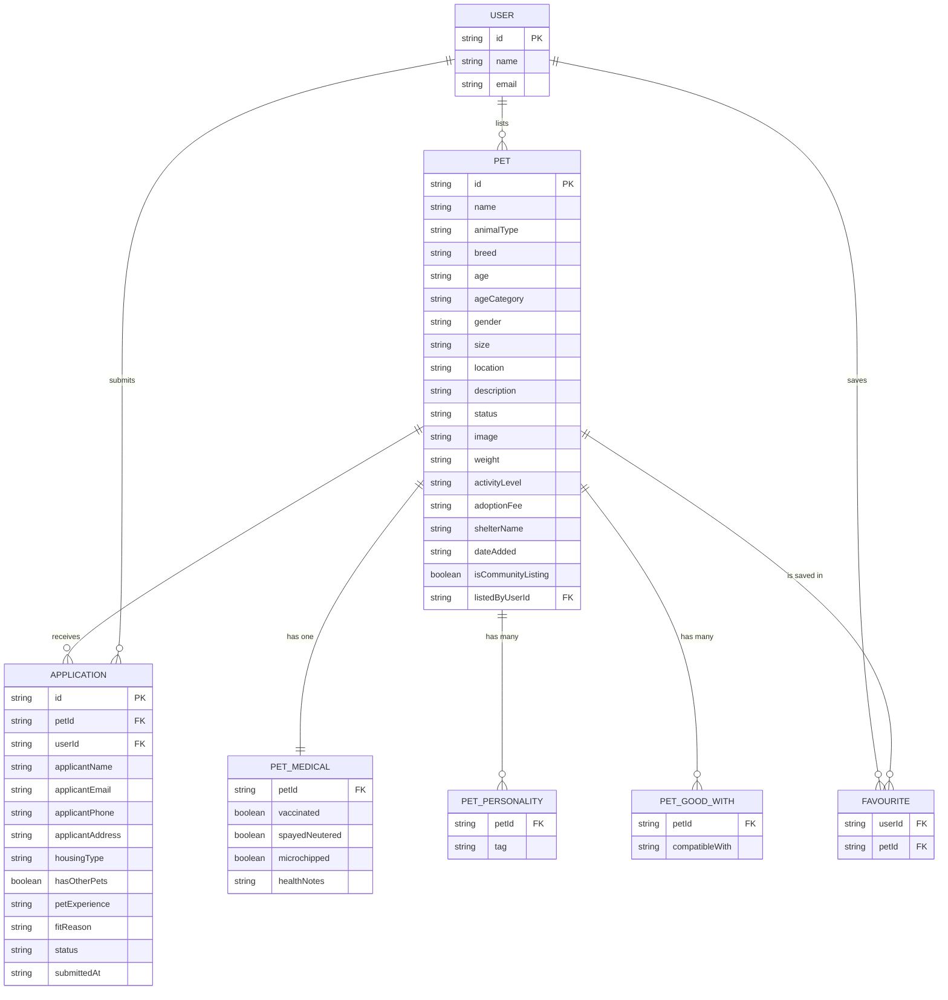

# FUREVER — Project Documentation

A pet adoption website for shelters in Bengaluru.

Built by [Sakina](https://github.com/sakinaeae) (design and initial build) and
[Phalak](https://github.com/phalakbhandari) (features, data layer, testing).

---

## Contents

1. [The problem and who we built it for](#1-the-problem-and-who-we-built-it-for)
2. [How a visitor moves through the site](#2-how-a-visitor-moves-through-the-site)
3. [Data design](#3-data-design)
4. [ER diagram](#4-er-diagram)
5. [The six views](#5-the-six-views)
6. [How the code is organised](#6-how-the-code-is-organised)
7. [Programming concepts used](#7-programming-concepts-used)
8. [Storage](#8-storage)
9. [Input validation](#9-input-validation)
10. [The design system](#10-the-design-system)
11. [Testing and checks](#11-testing-and-checks)
12. [Problems we hit and how we fixed them](#12-problems-we-hit-and-how-we-fixed-them)
13. [What is not built yet](#13-what-is-not-built-yet)

---

## 1. The problem and who we built it for

**Who.** People in Bengaluru who want to adopt a pet, and the shelters trying
to find homes for them.

**The problem.** Adoption in this city mostly happens through WhatsApp groups,
a few scattered shelter pages, and word of mouth. Someone hears about a dog
from a friend, calls three numbers, and hopes somebody answers. There is no
single place to see which animals are available, read enough about them to
decide, and start the process.

Shelters have the opposite problem. They have animals ready to go home and no
easy way to put them in front of people who are already looking.

**Our solution.** One website where you can:

- see every animal a partner shelter has listed
- filter by species, age, size, area of the city, and temperament
- read about each animal's personality before deciding to meet them
- send an adoption application and follow what happens to it
- list an animal yourself if you have found a stray or need to rehome a pet

The last one matters. It makes the site two-sided instead of a catalogue.

---

## 2. How a visitor moves through the site

```
                        Home page
                            |
        +-------------------+-------------------+
        |                   |                   |
     Browse              Swipe              Match quiz
   (filter list)      (card deck)      (5 answers, ranked results)
        |                   |                   |
        +-------------------+-------------------+
                            |
                     Pet profile
              (photo, personality, medical, shelter)
                            |
                     "Apply to adopt"
                            |
                    Signed in?  --- no ---> Sign in / create account
                            |                        |
                           yes <---------------------+
                            |
                    Adoption form
             (name, contact, home, experience)
                            |
                   Application submitted
                            |
                  My applications (tracking)


   Separate path, same gate:

     "List a pet"  --->  Signed in?  --- no ---> Sign in
                              |                     |
                             yes <------------------+
                              |
                       List a pet form
              (photo, details, temperament, contact)
                              |
                    Listing joins the catalogue
```

Two actions need you signed in: applying, and listing. Both remember what you
were trying to do. If you click "Apply to adopt" on Goldie while signed out,
the sign-in box says *"Sign in to apply for Goldie"*, and once you are in it
opens Goldie's application form rather than dumping you back on the home page.

---

## 3. Data design

Everything is a plain JavaScript object. There are four shapes.

### Pet

The main one. Lives in `src/data/petsData.js`.

```js
{
  id: 'pet-speckles',
  name: 'Speckles',
  animalType: 'Dog',
  breed: 'Indian Hound Mix',
  age: '1.5 years',
  ageCategory: 'Young',          // Young | Adult | Senior
  gender: 'Male',
  size: 'Medium',                // Small | Medium | Large
  location: 'Shelter Yard, Bengaluru',
  description: 'Speckles is a curious, energetic Indie hound mix...',
  personality: ['Energetic', 'Curious', 'Loyal', 'Social'],
  goodWith: ['Children', 'Dogs', 'Active Homes'],
  status: 'AVAILABLE',           // AVAILABLE | ADOPTED
  image: '/pets/speckles.jpg',
  medicalInfo: {
    vaccinated: true,
    spayedNeutered: true,
    microchipped: true,
    healthNotes: 'Fully vaccinated, dewormed, healthy shelter intake.'
  },
  weight: '18 kg',
  activityLevel: 'High',         // Low | Moderate | High
  adoptionFee: 'Free Adoption',
  shelterName: 'CARE Bengaluru Rescue Center',
  dateAdded: '2026-08-25'
}
```

Note `personality` and `goodWith`. They are **arrays inside an object**, which
is how one pet holds many tags without needing a second table.

`medicalInfo` is an **object inside an object**, grouping the medical fields so
they travel together.

### Listing

A pet added by a visitor. Same shape as a Pet, plus three fields:

```js
{
  // ...everything a Pet has, then:
  isCommunityListing: true,     // not from a partner shelter
  contactEmail: 'you@example.com',
  listedByUserId: 'user-mayaexamplecom'
}
```

`isCommunityListing` matters. A community listing makes no vaccination claims,
because we have no way to check them.

### Application

Created when someone submits the adoption form.

```js
{
  id: 'FUR-2026-4821',
  petId: 'pet-goldie',
  petName: 'Goldie',
  petImage: '/pets/goldie.jpg',
  applicantName: 'Maya Rao',
  applicantEmail: 'maya@example.com',
  applicantPhone: '9876543210',
  applicantAddress: 'Jayanagar 4th Block, Bengaluru',
  housingType: 'Apartment',
  hasOtherPets: false,
  petExperience: 'Experienced',
  fitReason: 'I work from home and have a large balcony...',
  status: 'Under Review',        // Under Review | Approved | Rejected
  submittedAt: '2026-08-27T14:32:00.000Z',
  timeline: { ... }
}
```

### User

```js
{
  id: 'user-mayaexamplecom',
  name: 'Maya Rao',
  email: 'maya@example.com'
}
```

No password. See [section 8](#8-storage).

---

## 4. ER diagram

There is no database. Data lives in JavaScript arrays and in the browser's
`localStorage`. But the *relationships* are real, and this is how they would
map onto tables if a database were added later.



### Reading the diagram

| Relationship | Type | Meaning |
| --- | --- | --- |
| PET to PET_MEDICAL | one-to-one | Every pet has exactly one medical record. |
| PET to PET_PERSONALITY | one-to-many | A pet has several temperament tags. |
| PET to PET_GOOD_WITH | one-to-many | A pet has several "good with" entries. |
| PET to APPLICATION | one-to-many | Several people can apply for the same pet. |
| USER to APPLICATION | one-to-many | One person can apply for several pets. |
| USER to PET | one-to-many | A person can list several pets of their own. |
| USER and PET via FAVOURITE | many-to-many | A person saves many pets; a pet is saved by many people. |

**Why FAVOURITE is its own box.** A many-to-many relationship cannot be stored
on either side. In a database it needs a join table with two foreign keys. In
our code the same idea is an array of pet IDs (`likedPetIds`) held against the
current user, which is the same relationship with only one user in it.

**Why PET_PERSONALITY is separate.** In a proper database you cannot put an
array in a column, so repeating values become their own table. In JavaScript
we can, so `personality: ['Energetic', 'Curious']` is an array on the pet
object. The diagram shows the database-correct version.

---

## 5. The six views

`App.jsx` keeps one piece of state called `currentTab`, and shows one view at a
time based on its value.

### View 1 — Home (`HomeView.jsx`)

The hero, a scrolling species band, the three-step explainer, the first six
pets, and a panel inviting you to list a pet.

### View 2 — Browse (`PetBrowseGrid.jsx`)

All 31 pets with filters. One `.filter()` runs over the list, and inside it
each rule returns `false` as soon as a pet fails. Getting out early is cheaper
and much easier to read than one long boolean expression.

```js
const filteredPets = useMemo(() => {
  return pets.filter((pet) => {
    if (selectedCategory !== 'All' && pet.animalType !== selectedCategory) return false;
    if (selectedAge !== 'All' && pet.ageCategory !== selectedAge) return false;
    if (selectedSize !== 'All' && pet.size !== selectedSize) return false;
    if (selectedGender !== 'All' && pet.gender !== selectedGender) return false;
    if (selectedActivity !== 'All' && pet.activityLevel !== selectedActivity) return false;
    // ...location, trait and search checks
    return true;                       // survived every rule
  });
}, [pets, selectedCategory, selectedAge, selectedSize /* ...and the rest */]);
```

`useMemo` means the list is only recalculated when one of those values actually
changes, not on every re-render.

There is also a grid/list toggle and pagination.

### View 3 — Swipe (`SwipeCardDeck.jsx`)

Cards stacked on top of each other. Motion tracks how far you drag. Past a
threshold, right saves the pet and left passes. Arrow keys do the same, and
there is an undo button.

### View 4 — Match quiz (`MatchQuizFinder.jsx` + `lib/matchScore.js`)

Five questions: species, age, size, breed, and area. Every pet is **scored**
against the answers, not filtered by them.

```js
export const WEIGHTS = { species: 40, age: 20, size: 20, breed: 12, area: 8 };

export function scorePet(pet, answers) {
  let score = 0;
  if (answers.species === 'All') score += WEIGHTS.species;
  else if (pet.animalType === answers.species) score += WEIGHTS.species;
  // ...the same shape for age, size, breed and area
  return { score, percent: Math.round((score / MAX_SCORE) * 100), reasons };
}

export function rankPets(pets, answers) {
  return pets
    .map((pet) => ({ pet, ...scorePet(pet, answers) }))   // score everything
    .filter((entry) => entry.percent >= THRESHOLD)        // drop the hopeless
    .sort((a, b) => b.score - a.score                     // best first
                 || a.pet.name.localeCompare(b.pet.name)); // stable ties
}
```

**Why scoring and not filtering.** The first version ran the same hard filters
as the Browse page, which made it a worse copy of a page we already had. Worse,
one wrong preference removed a pet completely, so someone who chose "Small"
never saw the medium dog that suited them in every other way. Scoring keeps
near misses, ranks them below exact matches, and shows a percentage so the
visitor can see how close each one was.

Three details worth noticing:

- An answer left as "All" awards its full weight to every pet. It is not an
  opinion, so it should not push anything down the list.
- Ties break on name, so the order never jumps around between renders.
- The weights sit in one object because they are a judgement, not a
  measurement. Arguing with them should mean editing one line.

This is the one part of the project with **unit tests** rather than browser
tests: `tests/matchScore.spec.js`. Pure functions are the easiest thing to test
properly, so they are tested properly.

### View 5 — My applications (`MyApplicationsView.jsx`)

Every application you have sent, with its status and a timeline.

### View 6 — How it works (`HowItWorks.jsx` + `FaqSection.jsx`)

The three steps and a set of frequently asked questions.

### Modals

Five, all loaded only when opened: pet profile, adoption form, saved
favourites, sign in, and list a pet.

---

## 6. How the code is organised

```
src/
├── components/       What you see. Props in, HTML out.
│   └── ui/           Small reusable pieces: Button, Tag, Reveal, Glyph...
├── hooks/            Reusable behaviour with state in it.
├── lib/              Helpers that touch the outside world.
├── data/             The 31 seeded pets.
└── utils/            Pure functions that do one thing.
```

The rule is: **components draw, hooks remember, lib does side effects.** A
component never touches `localStorage` directly.

### The hooks

| Hook | What it does |
| --- | --- |
| `useAuth` | Who is signed in, and which accounts this browser knows. |
| `useToast` | The little message that pops up bottom-right. |
| `usePetCollection` | The catalogue: seeded pets + community listings + order. |
| `usePersistentState` | `useState` that also saves to `localStorage`. |
| `useReveal` | Fades sections in as you scroll. |

### The lib files

| File | What it does |
| --- | --- |
| `storage.js` | All reading and writing of `localStorage`. |
| `matchScore.js` | Scores and ranks pets for the quiz. |
| `image.js` | Shrinks an uploaded photo before it is saved. |
| `celebrate.js` | Confetti, switched off under reduced motion. |

### Where state lives

All the shared state is in `App.jsx` and passed down as props. There is no
Redux and no Context.

**Why.** The deepest chain is two levels. You can follow any value from where
it is created to where it is used without opening a third file. Adding a state
library would remove a few prop lines and add indirection to every single one.
If the app grew shelter accounts, that trade would flip.

---

## 7. Programming concepts used

### Variables and data types

```js
const [currentTab, setCurrentTab] = useState('home');   // string
const [likedPetIds, setLikedPetIds] = usePersistentState(KEYS.likes, []); // array
const [petForProfile, setPetForProfile] = useState(null); // object or null
const isSignUp = mode === 'signup';                      // boolean
```

`const` everywhere unless a value genuinely needs to change. ESLint enforces
this with the `prefer-const` rule.

### Functions

Three kinds, used on purpose.

**Plain function** — a named block that does one job. `src/utils/shuffle.js`:

```js
export function shuffleArray(array) {
  const result = [...array];
  for (let i = result.length - 1; i > 0; i--) {
    const j = Math.floor(Math.random() * (i + 1));
    [result[i], result[j]] = [result[j], result[i]];
  }
  return result;
}
```

**Arrow function** — short, often passed to another function.

```js
const likedPets = pets.filter((pet) => likedPetIds.includes(pet.id));
```

**Function that returns a function** — so one handler serves many fields.
`ListPetModal.jsx`:

```js
const update = (field) => (event) => {
  setForm((prev) => ({ ...prev, [field]: event.target.value }));
};

// used as:  onChange={update('name')}   onChange={update('breed')}
```

### Classes and objects

**Object** — a bundle of named values. Every pet is one. So is every
application, every user, and every listing.

**Class** — `src/components/ErrorBoundary.jsx` is the one class in the project:

```js
export class ErrorBoundary extends Component {
  constructor(props) {
    super(props);
    this.state = { error: null };
  }

  static getDerivedStateFromError(error) {
    return { error };
  }

  componentDidCatch(error, info) {
    console.error('Unhandled error in the React tree:', error, info.componentStack);
  }

  render() { ... }
}
```

It uses `extends` (inheritance), `constructor`, `super`, `this`, an instance
method (`componentDidCatch`), a static method (`getDerivedStateFromError`), and
`render`.

**It has to be a class.** React only lets a class catch errors from the
components below it. There is no hook that does this. Everything else in the
project is a function, because functions are simpler and React prefers them now.

### Conditions

```js
// if / else
if (currentUser) {
  setPetForApplication(pet);
} else {
  setSignInIntent({ action: 'apply', pet });
}

// ternary (short if/else that produces a value)
{isSignUp ? 'Create an account' : 'Welcome back'}

// guard clause: leave early instead of nesting
if (!isOpen) return null;

// optional chaining and nullish default
const notes = pet.medicalInfo?.healthNotes ?? 'Not recorded';
```

### Loops

```js
// for loop, counting down — Fisher-Yates shuffle
for (let i = result.length - 1; i > 0; i--) { ... }

// .map() — turn a list of pets into a list of cards
{pets.map((pet) => <PetCard key={pet.id} pet={pet} />)}

// .filter() — keep only what matches
pets.filter((p) => p.status === 'AVAILABLE')

// .forEach() — do something for each item, return nothing
stale.forEach((key) => window.localStorage.removeItem(key));

// .reduce() — collapse a list into a single value
Object.values(WEIGHTS).reduce((total, weight) => total + weight, 0)

// .some() / .every() — true if any / all match
prev.accounts.some((a) => a.email === user.email)

// for...of — plain loop over a list, used in the check scripts
for (const [fg, bg, threshold] of pairings) { ... }

// .sort() — order a list. Returns negative, zero or positive.
.sort((a, b) => b.score - a.score || a.pet.name.localeCompare(b.pet.name))

// chaining them: score, drop, order — three steps, read top to bottom
pets
  .map((pet) => ({ pet, ...scorePet(pet, answers) }))
  .filter((entry) => entry.percent >= THRESHOLD)
  .sort((a, b) => b.score - a.score);
```

### Arrays and collections

```js
const catalogue = [...listings, ...INITIAL_PETS];       // spread: join arrays
const byId = new Map(all.map((pet) => [pet.id, pet]));  // Map: lookup by key
const seen = new Set(ordered.map((pet) => pet.id));     // Set: no duplicates
```

`Map` and `Set` are used in `usePetCollection.js` to re-apply a saved shuffle
order without scanning the whole array for every pet.

### Events

```js
onClick={() => onSelectPet(pet)}
onChange={(e) => setSearchQuery(e.target.value)}
onSubmit={handleSubmit}
window.addEventListener('keydown', handleKeyDown);      // arrow keys on the deck
window.addEventListener('scroll', onScroll, { passive: true }); // header
```

Every listener added in a `useEffect` is removed in that effect's cleanup, so
nothing keeps running after a component disappears.

---

## 8. Storage

### Where data lives

There is **no server and no database**. Everything a visitor does is kept in
`localStorage`, a small store the browser keeps per website.

### The keys

| Key | Holds |
| --- | --- |
| `furever:v5:likes` | Array of pet IDs you have saved |
| `furever:v5:applications` | Array of application objects |
| `furever:v5:listings` | Array of pets you have listed |
| `furever:v5:user` | The signed-in person, and known accounts |
| `furever:v5:order` | A saved shuffle order, as an array of pet IDs |

The `v5` is a schema version. If the shape of stored data changes, we raise the
number, every old key becomes invisible, and `pruneOldVersions()` deletes them
on the next page load.

### Everything goes through one file

`src/lib/storage.js`. No component calls `localStorage` directly.

```js
export function read(key, fallback) {
  try {
    const raw = window.localStorage.getItem(fullKey(key));
    return raw === null ? fallback : JSON.parse(raw);
  } catch {
    return fallback;               // storage disabled, or a corrupt value
  }
}

export function write(key, value) {
  try {
    window.localStorage.setItem(fullKey(key), JSON.stringify(value));
    return true;
  } catch {
    return false;                  // quota full, or storage disabled
  }
}
```

**Why the `try/catch`.** Safari in private mode throws when you write. A
half-written value from an older version can break `JSON.parse`. In both cases
the app should carry on with no saved data rather than showing a blank page.

**Why one file.** One place to handle a full quota. One place to change the
version. And one place to swap in a real API later, instead of hunting through
twenty components.

### The hook on top

```js
export function usePersistentState(key, initialValue) {
  const [value, setValue] = useState(() => read(key, initialValue));
  const isFirstRun = useRef(true);

  useEffect(() => {
    if (isFirstRun.current) {      // don't re-write what we just read
      isFirstRun.current = false;
      return;
    }
    write(key, value);
  }, [key, value]);

  return [value, setValue];
}
```

Used exactly like `useState`, but the value survives a refresh.

### What is deliberately not stored

The 31 seeded pets. They ship with the code, so saving a copy would waste the
quota and lock a visitor to an old catalogue after an update. Only community
listings and the chosen order are saved.

### Photos

A photo from a phone is 3 to 6 MB. The whole `localStorage` quota is about
5 MB. So `src/lib/image.js` redraws the picked file onto a `<canvas>` at a
maximum of 900 pixels and re-encodes it as JPEG at 82% quality first, which
brings it down to roughly 200 KB.

### About the "backend"

**There isn't one, and that is on purpose.** The site is a frontend that runs
entirely in the browser and deploys as static files anywhere.

What that means:

- Nothing is shared between people. A listing you create is visible to you, in
  that browser, until you clear your site data.
- Sign-in is not real authentication. It stores a name and an email so
  applications and listings can be labelled, and so the apply flow has
  something to check. **No password is ever stored.** It is checked for length
  and thrown away.
- To add a real backend you would replace `src/lib/storage.js` with API calls
  and make the hooks asynchronous. Nothing else would need to change. That is
  the whole reason storage was put behind one file.

---

## 9. Input validation

Two forms are validated: the adoption application and the pet listing. Both
check on submit, not on every keystroke, so nobody is told they are wrong while
still typing.

### Collect every error, not just the first

```js
function validate(form, photo) {
  const errors = {};

  if (!form.name.trim()) errors.name = 'Give the pet a name.';
  else if (form.name.trim().length > 30) errors.name = 'Keep the name under 30 characters.';

  if (!form.breed.trim()) errors.breed = 'Breed or mix, as best you know it.';
  if (!form.age.trim()) errors.age = 'Roughly how old? "8 months" is fine.';
  if (!form.location.trim()) errors.location = 'Where is the pet right now?';

  const description = form.description.trim();
  if (description.length < 40) {
    errors.description = 'Give adopters something to go on, at least 40 characters.';
  } else if (description.length > 600) {
    errors.description = 'Keep it under 600 characters.';
  }

  if (!form.contactEmail.trim()) errors.contactEmail = 'Adopters need a way to reach you.';
  else if (!/^[^\s@]+@[^\s@]+\.[^\s@]+$/.test(form.contactEmail.trim())) {
    errors.contactEmail = 'That does not look like a valid email address.';
  }

  if (!photo) errors.photo = 'A photo does most of the work. Please add one.';

  return errors;
}
```

Showing one error at a time turns a form into a guessing game.

### Email and phone

```js
// Structure only. Anything stricter rejects addresses that actually work,
// and the only real proof is sending mail to it.
const EMAIL_PATTERN = /^[^\s@]+@[^\s@]+\.[^\s@]+$/;

// Count digits instead of matching a format, so +91, spaces and hyphens pass.
const phoneDigits = phone.replace(/\D/g, '');
if (phoneDigits.length < 10) errors.phone = 'Please enter a valid phone number';
```

### File upload

```js
if (!['image/jpeg', 'image/png', 'image/webp'].includes(file.type)) {
  reject(new Error('That file type is not supported. Use a JPG, PNG, or WebP image.'));
}
if (file.size > 8 * 1024 * 1024) {
  reject(new Error('That image is larger than 8 MB. Try a smaller one.'));
}
```

### Errors clear as you fix them

```js
const update = (field) => (event) => {
  setForm((prev) => ({ ...prev, [field]: event.target.value }));
  setErrors((prev) => (prev[field] ? { ...prev, [field]: undefined } : prev));
};
```

The `prev[field] ?` check matters: returning `prev` unchanged when there was no
error avoids a pointless state update on every keystroke.

### Showing errors properly

```jsx
<input
  id="list-pet-name"
  aria-invalid={errors.name ? 'true' : undefined}
  aria-describedby={errors.name ? 'list-pet-name-error' : undefined}
/>
{errors.name && (
  <p id="list-pet-name-error" role="alert">{errors.name}</p>
)}
```

`aria-describedby` ties the message to the field, so a screen reader says
"Name, invalid, give the pet a name" instead of leaving the error stranded as
unrelated text. After a failed submit, focus moves to the first bad field, and
nothing already typed is ever cleared.

---

## 10. The design system

### Colours

Named for what they are, not where they are used, so `bg-linen` is readable
without a lookup. All defined in `src/index.css`.

| Token | Value | Used for |
| --- | --- | --- |
| `ochre` | `#EBB042` | Hero and footer background |
| `cream` | `#FAF6F0` | The page |
| `paper` | `#FFFFFF` | Cards and inputs |
| `linen` | `#F2ECE3` | Recessed bands |
| `ink` | `#222222` | Text, and the primary button |
| `ink-muted` | `#5C564E` | Secondary text |
| `mist` | `#EAF0FB` | The blue panel |
| `sky` | `#D3E3EC` | Tag chips |
| `brick` | `#A6402A` | Errors |
| `moss` | `#3F6B45` | Success |

### Contrast is checked by the computer, not by eye

`npm run check:contrast` reads the real colour values out of `src/index.css`
and measures every text-on-background pair against WCAG AA (4.5:1 for normal
text). It runs in CI, so the palette cannot drift.

It found two real failures the moment it was written:

- the success green was `#0F942D`, which is **3.7:1** on cream and had been
  shipping
- the first choice for secondary text passed on cream at 5.4:1 and failed on
  the blue tag chips at **4.4:1**

One pair is deliberately below the standard: the giant `furever` wordmark,
cream on ochre at 1.8:1. WCAG allows this for a logo. A test checks that
nothing *else* on the page uses that pair.

### Type

**Fraunces** for headings, **Inter** for everything else. Both are variable
fonts, both self-hosted, so no request goes to a font CDN.

Only small labels are uppercase. Headings and buttons are sentence case.

### Motion

One easing curve everywhere: `cubic-bezier(0.22, 1, 0.36, 1)`.

Scroll reveals use **one** `IntersectionObserver` for the whole page rather
than one per component, and each element is unobserved after it fires.

Everything stops under `prefers-reduced-motion`. There is a test for it.

---

## 11. Testing and checks

### Automated tests

`npm test` runs 28 tests: 12 unit tests for the quiz scoring, and 16 Playwright
tests against a real production build on a desktop and a mobile screen size.

| Test | Checks |
| --- | --- |
| Home page loads | No console errors, no failed requests, **no image with zero width** |
| Favourite survives reload | Saving works and the catalogue order is stable |
| Listing needs sign-in | The gate holds and explains itself |
| Dialog focus | Focus moves inside on open, Escape closes |
| Empty listing refused | Every required field explains itself |
| Wordmark contrast | Only the logo uses cream-on-ochre |
| Reduced motion | Nothing is left invisible when animation is off |
| Catalogue reachable | Navigation works on both screen sizes |
| Quiz scoring | Full marks with no answers, near misses ranked lower, stable ties |

### Other checks

| Command | Checks |
| --- | --- |
| `npm run lint` | ESLint, including accessibility rules, as errors |
| `npm run format:check` | Prettier formatting |
| `npm run check:assets` | Images are not corrupt and are within a size budget |
| `npm run check:contrast` | Every colour pair meets WCAG AA |
| `npm run verify` | All of the above, then a build |

All of it runs in GitHub Actions on every push.

---

## 12. Problems we hit and how we fixed them

**Every image in the project was corrupted.** 94 of 98 files. Early on the
images were copied as text, which replaced every byte above `0x7F` with the
Unicode replacement character. The files kept their names and grew by about
60%, so `calender.png` went from 735 KB to 1.3 MB. That made it look like a
compression problem for a while. `daisy.jpg` stopped being recognisable as a
JPEG at all.

An earlier attempt to fix it patched only the first byte, which restored the
PNG header. `file` then reported a valid PNG and the images stayed broken.
**A header check is not an integrity check.**

The real fix was to restore all 94 files and stop it recurring: `.gitattributes`
marks every binary format as binary so no checkout can convert one, and
`npm run check:assets` counts replacement characters per kilobyte and fails the
build.

**Icons were 2048x2048 and shipped twice.** Artwork drawn at 40 to 56 pixels on
screen was being downloaded at full resolution, once from `public/` and again
bundled into the JavaScript. About 70 icons render on the home page at once,
which is what made it stutter. Resizing to 128 pixels and serving one copy took
the icon set from **35 MB to 154 KB**.

**The catalogue reshuffled itself on every page load.** `INITIAL_PETS` was
`shuffleArray(RAW_PETS)` run when the file loaded. So the Shuffle button did
nothing you could see, pagination was never the same twice, and saved
favourites looked like they had vanished because the pet had moved to a
different page. Found by the test that checks a favourite survives a reload.

**The match quiz was a worse copy of the Browse page.** It ran the same hard
filters, so answering five questions just gave a shorter list, and one wrong
answer removed a pet entirely. Replaced with weighted scoring.

**Modal animations were used but never written.** `animate-fadeIn` and two
others appeared in seven components and were defined nowhere, so every dialog
snapped into place.

**Arrow keys swiped the deck through an open dialog.** The keyboard listener
was global and unguarded, so reading a pet profile and pressing an arrow key
silently swiped the card behind it.

**The form recorded an address it never asked for.** Every application carried
`applicantAddress` and `hasOtherPets`, and neither had a field. Both are now
asked for.

**98 accessibility problems.** Pet cards were clickable `<div>`s that a keyboard
could not reach, six form labels had no `htmlFor`, and dialogs had no focus
management at all. Fixed rather than switched off.

---

## 13. What is not built yet

Stated plainly, because pretending otherwise would be worse.

- **No real authentication.** Sign-in stores a name and email and verifies
  nothing.
- **Nothing is shared between people.** A listing exists in one browser.
- **Most catalogue photos come from Unsplash** and will not load offline. The
  page falls back to a paw print rather than a broken image, but the real fix
  is hosting them.
- **The match quiz is a weighted sum**, not machine learning. The weights are a
  judgement we made, not something measured from real adoptions.
- **The contrast check covers tokens, not composition.** It proves the palette
  is sound; it cannot see a component that misuses a colour anyway.

### Where it would go next

1. A real backend. Postgres and a small API. `storage.js` is already the seam.
2. Shelter accounts, so a shelter manages its own listings and sees applications.
3. Hosted images with responsive sizes.
4. Application status that a shelter actually moves along.
5. Saved searches and alerts. *"Tell me when a calm, apartment-friendly cat is
   listed in Indiranagar"* is the feature that would bring people back.
