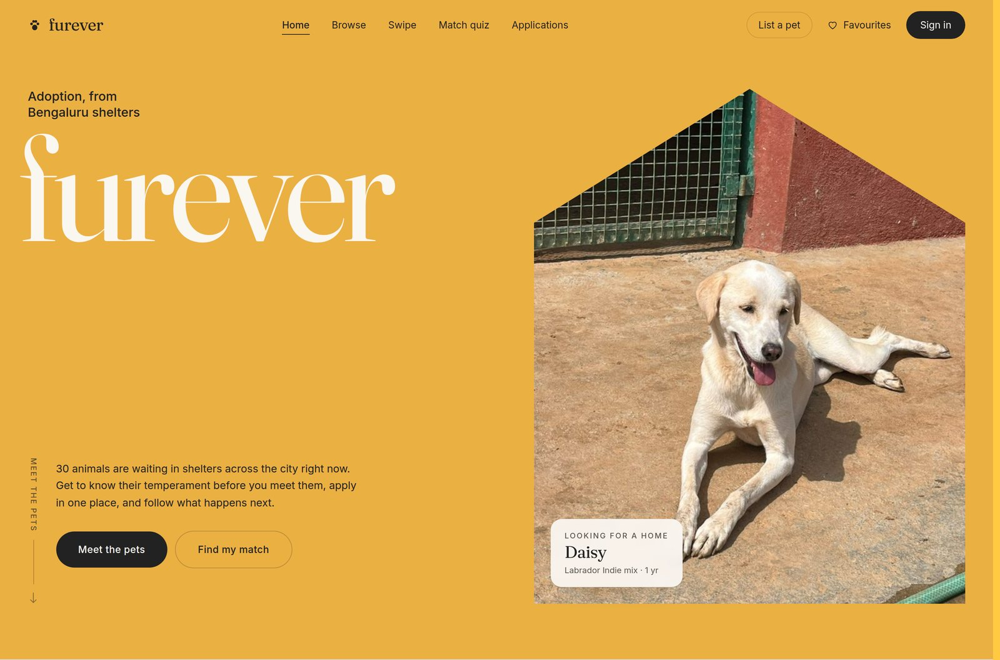
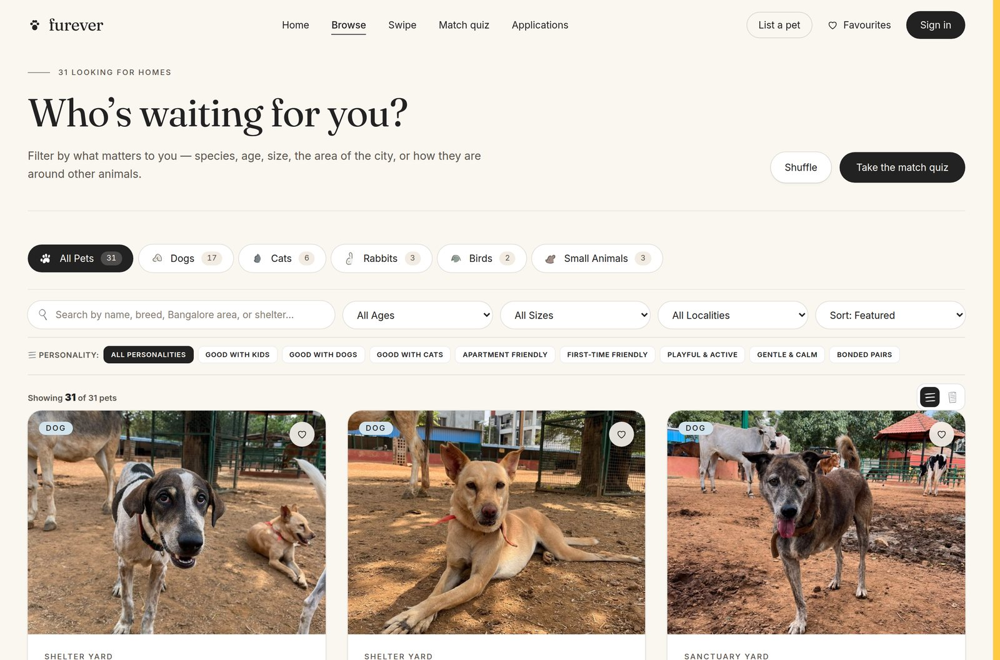
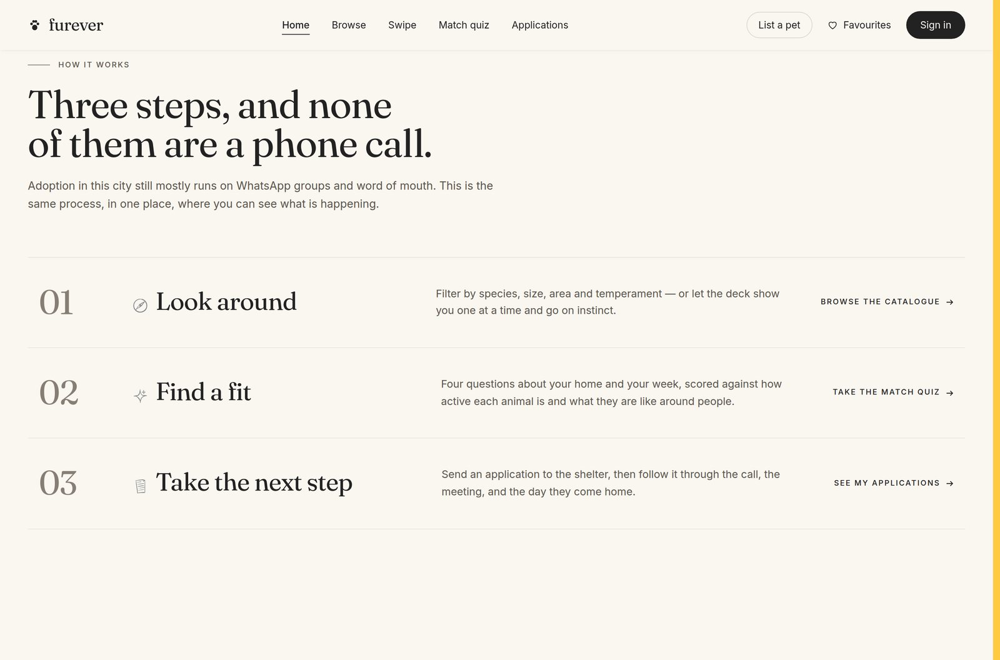
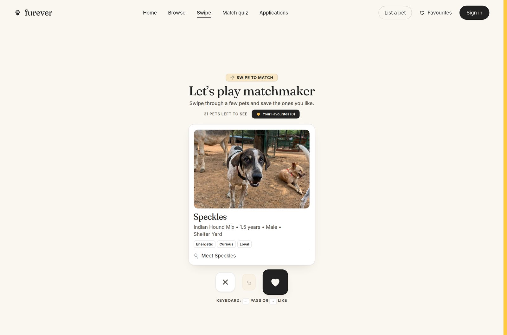
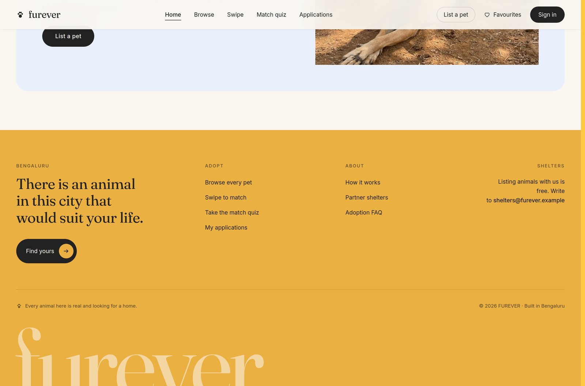

# FUREVER

A pet adoption site for Bengaluru shelters. Browse animals looking for homes,
get a sense of their temperament before you go and meet them, apply to adopt,
and list a stray you have found yourself.

Adoption here still mostly happens over WhatsApp groups and phone calls. You
hear about a dog through a friend, ring three numbers, and hope someone picks
up. FUREVER is an attempt at the boring, useful version of that: one place to
look, enough detail to decide, and a form instead of phone tag.



Built by [Sakina](https://github.com/sakinaeae) and
[Phalak](https://github.com/phalakbhandari).

---

## Running it

```bash
npm install
npm run dev
```

That is the whole setup. No server, no database, no API keys. The app runs
entirely in the browser and keeps your favourites, applications and listings in
`localStorage`. It builds to static files and deploys to any static host.

Needs Node 20 or newer.

| Command | What it does |
| --- | --- |
| `npm run dev` | Dev server on port 3000 |
| `npm run build` | Production build into `dist/` |
| `npm run preview` | Serve the production build locally |
| `npm test` | 28 Playwright tests, unit and end-to-end |
| `npm run lint` | ESLint, including accessibility rules |
| `npm run check:assets` | Image integrity and size budget |
| `npm run check:contrast` | WCAG AA check on every colour pairing |
| `npm run verify` | Everything CI runs, in one command |

Running the tests needs the browser once: `npx playwright install chromium`.

---

## What it does

**Browse.** Filter by species, age, size, locality and temperament, in a grid
or a detail list. 31 pets, searchable.

**Swipe.** A card deck for when you would rather react than filter. Drag, or
use the arrow keys. Right saves, left passes, and you can undo.

**Match quiz.** Five questions, and every pet is scored against your answers
and ranked. Near misses still show up, lower down, with a percentage. It does
not hide the medium dog because you said you wanted a large one.

**Apply to adopt.** A form that asks what a shelter would ask, with the answers
tracked afterwards under My Applications.

**List a pet.** The other half of the marketplace. Found a stray, or rehoming
your own? Add a photo and a description and it joins the catalogue.

<table>
<tr>
<td width="50%"></td>
<td width="50%"></td>
</tr>
<tr>
<td width="50%"></td>
<td width="50%"></td>
</tr>
</table>

---

## How it is built

React 19 and Vite 6, styled with Tailwind v4, animated with Motion. Plain
JavaScript rather than TypeScript, which is a deliberate choice for a project
this size: the type surface is one `pet` shape, and the cost of the toolchain
outweighs what it would catch.

Type is Fraunces and Inter, both variable and both self-hosted, so no request
goes to a font CDN.

```
src/
├── components/
│   ├── ui/         Primitives: Button, Tag, Reveal, Glyph, SectionIntro.
│   └── ...         Feature components, one file each.
├── hooks/          Stateful behaviour: auth, toasts, the catalogue, reveals.
├── lib/            Side effects: storage, image resizing, scoring, confetti.
├── data/           The seeded catalogue.
└── utils/          Pure functions.
```

State lives in `App.jsx` and is passed down as props. No state library and no
context provider, because at this size neither earns its keep. The deepest prop
chain is two levels, and you can follow any value from where it is declared to
where it is used without opening a third file.

Persistence goes through `src/lib/storage.js` rather than touching
`localStorage` directly. That gives one place to handle a quota error, one
place to version the schema, and one seam to replace when there is a real
backend.

Every dialog renders through `ModalShell`, which owns the behaviour that is
identical everywhere and easy to get subtly wrong: focus moves into the dialog
on open and back to the trigger on close, Tab is trapped, Escape closes, and
the page behind stops scrolling.

Modals are behind `React.lazy`. None of them is on the first-paint path, and
the adoption form pulls `canvas-confetti` in with it.

---

## Two checks that are not boilerplate

Both were written after a real problem, and both found something the moment
they ran.

### Image integrity

Early in the project every image we had was silently corrupted. All 94 of them.
The binaries had gone through a text filter, which rewrote each byte above
`0x7F` as the UTF-8 replacement character. The files kept their names and grew
by about 60%, so `calender.png` went from 735 KB to 1.3 MB, which is why the
damage read as "large images" rather than "broken images" for a while.
`daisy.jpg` stopped identifying as a JPEG at all.

An earlier attempt to fix it patched only the first byte. That restored the PNG
magic number, so `file` reported a valid PNG while the pixel data behind it was
still shredded. A header check is not an integrity check.

Two things came out of it. `.gitattributes` marks every binary format as
binary, so no checkout can apply line-ending conversion to a PNG, and
`npm run check:assets` fails the build if it happens anyway. It checks magic
bytes, counts replacement-character sequences per kilobyte, and enforces a size
budget.

While sorting that out, the icons turned out to be 2048x2048 PNGs rendered at
40 to 56 pixels, shipped twice over. Resizing them and serving one copy took
the icon set from **35 MB to 154 KB**.

### Colour contrast

`npm run check:contrast` reads the real hex values out of `src/index.css` and
measures every foreground and background pairing the app uses against WCAG 2.1
AA. It runs in CI, so nobody can nudge a grey two steps lighter because it
looked better on their monitor and quietly drop body text under 4.5:1.

It found two failures the moment it was written:

- The success green was `#0F942D`, which is **3.7:1** on cream. It had been
  shipping.
- The first pick for secondary text passed on cream at 5.4:1 and failed on the
  sky-blue tag chips at **4.4:1**. Checking a colour against the lightest
  ground it ever lands on, rather than the most common one, is what caught it.

One pairing is deliberately below the bar and listed as an exemption with its
reason: the cream-on-ochre wordmark at 1.8:1, which WCAG exempts as a logotype.
A test asserts that exactly one element on the page uses it.

---

## Testing

`npm test` runs 28 tests. Twelve are unit tests for the quiz scoring, which is
plain functions and can be tested directly. Sixteen are end-to-end tests
against a real production build on a desktop and a mobile viewport: favourites
surviving a reload, the sign-in gate, focus trapping and Escape, form
validation, and navigation on both screen sizes.

Three assertions exist because of specific things that went wrong here:

- The home page test fails if any local image finishes loading with a zero
  intrinsic width, which is what a corrupted or missing file looks like from
  the DOM.
- One test walks the computed styles of every text node and fails if anything
  but the wordmark is cream-on-ochre, so the WCAG logotype exemption cannot
  quietly spread to real text.
- One emulates `prefers-reduced-motion` and fails if any element is left hidden
  by a reveal animation that will never run.

CI runs lint, formatting, both checks, a build and the full suite on every push.

---

## Accessibility

Not an afterthought, and not perfect. What is done:

- ESLint runs `jsx-a11y` rules as errors, not warnings.
- A skip link, and one `<main>` landmark.
- Dialogs trap focus, restore it on close, and respond to Escape.
- Pet cards are `<article>` elements with a single real button rather than
  clickable `<div>`s. The card stays clickable by mouse through an overlay, but
  there is one thing in the tab order, not zero.
- Toasts are mirrored into an `aria-live` region.
- Form errors are tied to their fields with `aria-describedby`, and focus moves
  to the first problem on a failed submit.
- `prefers-reduced-motion` stops the marquee, the reveals and the confetti.
- Colour is verified in CI rather than by eye.

---

## What is not done

Being straight about it:

- **There is no real authentication.** Sign-in stores a name and email and
  checks nothing. No password is ever stored. It exists so applications and
  listings can be attributed. `useAuth` is the only file that would change.
- **Nothing is shared between people.** A listing you create is visible to you,
  in that browser, until you clear your site data. This is a frontend, not a
  product.
- **Most catalogue photos are hotlinked from Unsplash** and will not load
  offline. `PetImage` degrades to a paw print rather than a broken-image icon,
  but the real fix is hosting them.
- **The quiz weights are a judgement**, not measured from real adoptions.
- **The contrast check covers tokens, not composition.** It proves the palette
  is sound; it cannot see a component that misuses a colour anyway.

---

## Where it could go

Roughly in the order that would add the most:

1. A real backend. Postgres and a small API. The storage layer is already a
   seam, so swapping it is a contained change rather than a rewrite.
2. Shelter accounts, so a shelter manages its own listings and sees
   applications rather than everything being seeded.
3. Hosted images with responsive sizes, which removes the Unsplash dependency.
4. Application status that means something, with a shelter moving an
   application from received to met to placed.
5. Saved searches and alerts. "Tell me when a calm, apartment-friendly cat is
   listed in Indiranagar" is the feature that would bring people back.

---

## Documentation

- [DOCUMENTATION.md](DOCUMENTATION.md) — how it works, the data design, the ER
  diagram, and the decisions behind it.
- [UNDERSTAND.md](UNDERSTAND.md) — a walkthrough of the code by topic. Which
  file to open for classes, loops, storage, validation and the rest.

## Licence

MIT. See [LICENSE](LICENSE).

Pet photography from partner shelters, plus placeholder imagery from Unsplash.
Icon artwork is original to the project. Fraunces and Inter are both under the
SIL Open Font License.
